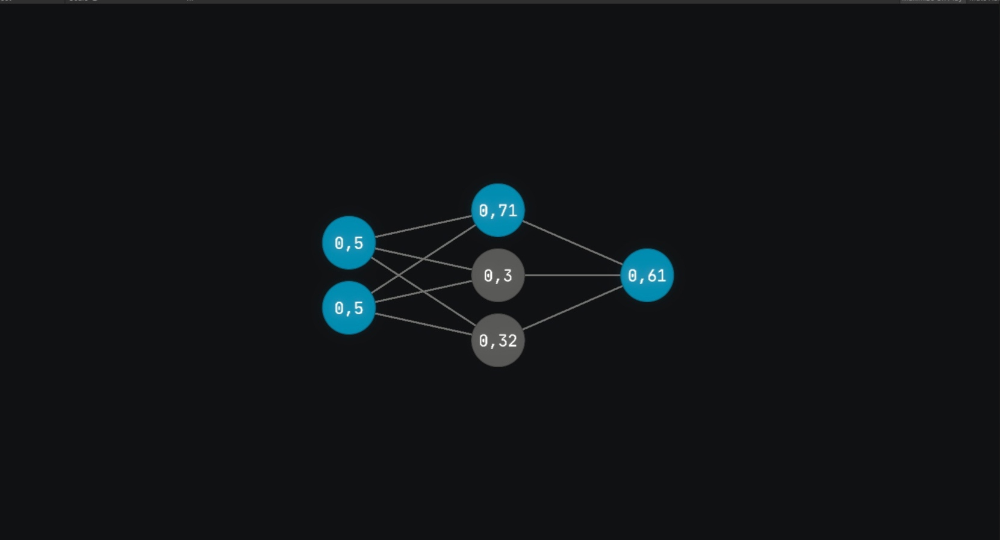

<h1>:school: Макет нейронной сети | Школьный проект :school:</h1>

School neural network project

</img>

<h1>Что может?</h1>

Приложение позволяет создавать макет нейронной сети и задавать в ней произвольное количество слоев и нейронов.  
На данный момент доступны две функции: подсчет значений с использованием текущих весов и обучение.  
Сохраненные веса записываются по такому пути NeuralNetworkModel_Data/StreamingAssets/NeuralNetworkData/weights.txt
Функция задания своей собственной тренировочной выборки отсутствует.

<h1>Как запустить?</h1>

Для запуска просто загрузите <a href="https://github.com/SamJoll/NeuralNetworkModel/releases">релиз или пререлиз</a> приложения, распакуйте архив и запустить файл NeuralNetworkModel.exe
  
